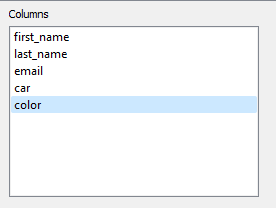

# Mailing machine

Application for email sending automation using Outlook. Application requires Outlook desktop preinstalled in order to function. **Works only on Windows OS**. 

### Main use case:
1. Download code from this repository
1. Unpack the code and using cmd navigate to directory with code
1. Type in `python outlook.py` to run the application
1. Load data from `.csv` file:
   1. click on "File" action button on the left corner of the main window
   2. click "Open data file"
   3. select file with data to load
2. If data loads correctly, dialog with confirmation should pop up, in case of incorrect data there should be window with error message:

- **Data loaded correctly:**

   

- **Data loaded incorrectly:**

   

- If loaded data has other type of separator than ";" sign, the "Change separator" action should be used:
  - click on the "Change separator" action button in the "File" action section. Dialog with line edit should open:
   
   

  - type in correct separator which fits database
  - load database again with "Open data file" action button
- Data loaded successfully:

   

- In the **Columns** list section all columns from database should be loaded:

   

6. Add columns to **Selected variables** section on the right by clicking on each column name in **Columns** list and **Add** button:

   

- If you want to remove certain columns from **Selected variables** click on the column name and then click **Remove** button
- If you want to clean list of selected variables, click on the **Clean** button below the list 

7. Add column with email addresses which should receive messages to **Addresses** line edit by clicking **Copy addresses** button, while having cursor focused on correct column in **Columns** section:

   

8. Type in sender's email address in **From** line edit:

   

9. Type in subject for email messages in **Subject** line edit:

   

10. Write message in **Email body** plain text section:

   

## Important!
**If you want to add data from database to your email messages then:**
- click on **Copy selected** button while focusing mouse cursor on chosen variable in the **Selected variables** list
- paste selected variable to email body **between the <<>> signs**, for example:
  
   
- it will cause iteration over selected columns from database which outputs one message per one row from database with the data from chosen row

11. Send email messages:
   - if you want to test whether the data loads correctly to messages  click on **Test send** button
   - if you want to send real messages click on **Send** button. Dialog with confirmation should pop up:
   
   - after clicking "Ok" another window should open with printed email messages
   - in case of error dialog with error message should open
